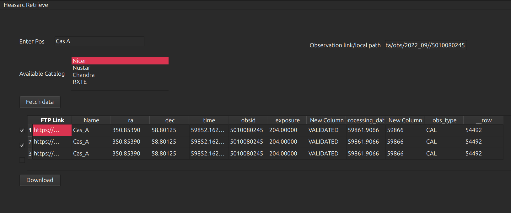
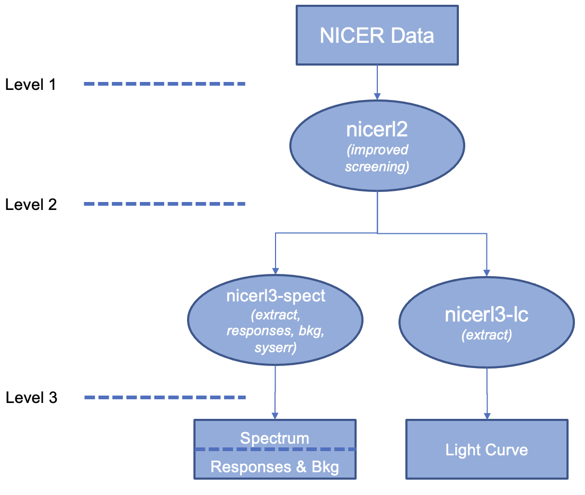
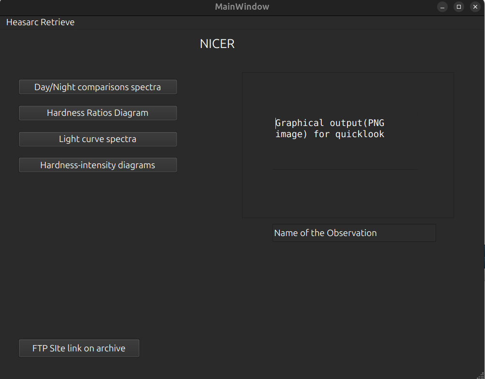

# Interactive Database for X-ray observations

## Personal Details

Name: Ankit Khushwaha <br>
University: Indian Institute of Technology Dharwad <br>
Time Zone: IST (GMT+5:30) <br>
Email: ankitkhushwaha.dev@gmail.com <br>
Github username: [ankitkhushwaha](https://github.com/ankitkhushwaha/) <br>
Slack username: [Ankit Khushwaha](https://stingraysoftware.slack.com/team/U08DABBB6EA) <br>
Mentor: [mgullik](https://github.com/mgullik), [matteobachetti](https://github.com/matteobachetti)

### Platform Details

- OS: Ubuntu 24.04.2 LTS
- Editor: VS Code

## Personal Background

Hey, I'm Ankit Khushwaha, a third year undergraduate at Indian Institute of Technology, Dharwad pursuing Bachelor of Science in Physics. I have been programming for the past three years, primarily using Python. I’ve been using Python for tasks like web scraping, automation, and scientific computing. I'm genuinely interested in open-source and have been contributing to since december 2024.

## My Contribution to Stingray

#### PRs
1. [Stingray] [Add Jacobian to GeneralizedLorentz1D, SmoothBrokenPowerLaw in stingray.simulator.models
 #889](https://github.com/StingraySoftware/stingray/pull/889) [Open]
2. [Stingray] [Add CountSpectrum to docs #884](https://github.com/StingraySoftware/stingray/pull/884) [Merged]
3. [Stingray] [Add support for reading Fermi/gbm fits file in Eventlist.read #894](https://github.com/StingraySoftware/stingray/pull/894) [Open]
4. [Stingray] [Remove unused imports #900](https://github.com/StingraySoftware/stingray/pull/900) [Open]
5. [Stingray] [Add AI-Note #891](https://github.com/StingraySoftware/stingray/pull/891) [Open]
6. [Stingray] [Fixes upstream Depecration warnings #885](https://github.com/StingraySoftware/stingray/pull/885) [Closed] # Fixes in [#886](https://github.com/StingraySoftware/stingray/pull/886)

#### Issues
1. [Stingray] [Test failure of Stingray file #882 ](https://github.com/StingraySoftware/stingray/issues/882#issuecomment-2662330600)
2. [Stingray] [Unused imports within stingray.codebase #899](https://github.com/StingraySoftware/stingray/issues/899) 
3. [Stingray] [AI note #890](https://github.com/StingraySoftware/stingray/issues/890)

#### Peer Reviews
1. [Stingray] [Guided about opening a good pr][ PR #895](https://github.com/StingraySoftware/stingray/pull/895)
2. [Stingray] [Helped in understanding the issue][ Issue #902](https://github.com/StingraySoftware/stingray/issues/902)
3. [Stingray.jl] [Suggested changes][ PR #10](https://github.com/StingraySoftware/Stingray.jl/pull/10)


## My Contribution to Openastronomy
#### PRs

1. [openastronomy.github.io] [Correct broken link in Radis Gsoc Proposal #377](https://github.com/OpenAstronomy/openastronomy.github.io/pull/377) 
2. [Sunpy](https://github.com/sunpy/sunpy/issues?q=is%3Apr+is%3Aopen+author%3Aankitkhushwaha) # Implemented Various features, improving code performance and fixed bugs.
3. [sunpy/package-template](https://github.com/sunpy/package-template/issues?q=is%3Apr%20state%3Aopen%20author%3Aankitkhushwaha) # Implemented the Github Workflows for update the each repo with package-template.

#### Issues
1. [Astropy/astroquery](https://github.com/astropy/astroquery/issues?q=is%3Aissue%20state%3Aopen%20author%3Aankitkhushwaha) # Raised issues to support some features
2. [Sunpy](https://github.com/sunpy/sunpy/issues?q=is%3Aissue%20state%3Aopen%20author%3Aankitkhushwaha) # Raised issues for bugs.

<br>
Apart from this I have also guided the newcomers on Slack by guiding them on how to get started with the project and reviewed their PRs on github.
<br>

## Project Proposal

### Abstract

The current approach to studying accreting black holes by considering only a few observations and only one data product at a time. This case-by-case approach is useful to study specific characteristics of the sources such as measuring the spin and mass of the black hole. However, this approach is insufficient to gain an understanding of the general phenomenology shown by accreting black holes. This project proposes the development of an interactive tool that systematically analyzes, stores, and organizes key data products from multiple observations. By enabling comprehensive visualization and comparison of X-ray spectral and timing properties over time, this tool will facilitate more efficient scientific decision-making and a deeper understanding of black hole evolution.


## Benefits to the Community

Currently, researchers analyze **only a few observations at a time**, limiting our understanding of the general behavior of black holes. This project will:

- Provide a **single framework** to explore multiple data products (e.g., spectral and timing properties).
- **Speed up scientific decision-making** by allowing easy comparison across different telescopes.
- Allow researchers to **discover patterns** and classify observations using **machine learning (ML)**.
- Enable **large-scale classification and visualization** of X-ray observations.

## Final Deliverables
- Analysis ready software packed with docker and also with manual installtion of Heasarc for more performance.

<!-- # Notes
the ability to visualize source behaviour over time across multiple metrics will guide our choices for which observations are best to make in future, as well as which observatories to use. It will also allow us to make quicker decisions on how to use the data that is already accessible for a given project<br> -->


## IMPLEMENTATION
### 1. Installtion of Required Packages
This Project requires the [Heasarc Software](https://heasarc.gsfc.nasa.gov/docs/software/lheasoft/download-go.html), we will first install the [Heasarc](https://heasarc.gsfc.nasa.gov/docs/software/lheasoft/download-go.html) software in isolated enviroment (To avoid confict with other software like CIAO or XMM-SAS) with  [hwrap script](https://heasarc.gsfc.nasa.gov/docs/software/lheasoft/hwrap.html) with required calibration files and geomagnetic quantities,Since the installation step are too complicated,we will document the installtion step (Pre GSOC).<br>
This is [instruction](link) that i wrote for the installtion of Heasarc Software.


### 1. **Fetch the X-ray observation data from archive**<br>
We will query the the observation data from Heasarc [FTP Website](https://heasarc.gsfc.nasa.gov/FTP/nicer/data/obs/) by [Astroquery.Heasarc](https://astroquery.readthedocs.io/en/latest/heasarc/heasarc.html).

```python
from astroquery.heasarc import Heasarc
from astropy.coordinates import SkyCoord

class Retrieve_Heasarc:
    
    @classmethod
    def filter_data(self):
        """
        This Will intergrate with UI and user will filter the 
        data based on different features. 
        """

    @classmethod
    def fetch_data(self, pos , catalog = 'nicermastr'):
        """
        This will return the Obs data to UI. 
        Which will be displayed by UI.
        """
        pos = SkyCoord.from_name(pos)
        tab = Heasarc.query_region(pos, catalog = catalog)
        tab = self.filter_data(tab)
        return tab
    
    @classmethod
    def download_obs(tabs, obs_to_download):
        """
        download the observation from fetch_data or direct link 
        provided as input.
        """
        links = Heasarc.locate_data(tab(obs_to_download))
        tab = tabs
        tab.add_columns(links['access_url'], name = 'access_url', index = 0)
        if obs.size > 10 'Gb':
            # shows a msg stating the size of Observation data 
            # Downloads observation in Chunks
        else:
            obs = Heasarc.download_data(links = links)
        obs_download_status = True if obs.file.exists else False
        return obs_download_status
```

**This is the UI for the Heasarc data petrieve pipeline.**<br> 
The user inputs an object name, selects multiple missions, and fetches observational data. The retrieved data appears in a table in pop-up window, allowing the user to select multiple entries and download them simultaneously, and filter their desired data.
<br>

### 2. Running the Heasarc Command with python
For the cleaning of observation files of various sources (eg. Nicer, NuSTAR), we need the HEASoft tools, which runs on bash. But
these commands also can be run in Python with [HEASoftpy](https://heasarc.gsfc.nasa.gov/lheasoft/heasoftpy/). It provides python wrappers that call the HEASoft tools, allowing for easy integration into other python code.


```python
import heasoftpy as hsp
nicerl3 = hsp.HSPTask('nicerl3-spect')
nicerl3.clobber="yes"
nicerl3.geomag_path=paths.geomag_path
nicerl3(infile='5010080245')
```

### 3. Nicer Data Processing Pipeline

Processing the observation files before analysis is a crucial step in extracting useful insights data.<br>
Heasarc provide [streamlined steps](https://heasarc.gsfc.nasa.gov/docs/nicer/analysis_threads/) for processing the Nicer observation files.<br>
<br>
Figure 1.This is Wokrflow showing nicerl3-spect and nicerl3-lc to make standard spectral and light curve products.<br>

Before starting the analysis, we need to clean the event file using `nicerl2`.This tool streamlines the standard pipeline processing of an observation by eliminating intermediate steps.

The extraction of Spectrum can be done from the observation file with [nicerl3-spect](https://heasarc.gsfc.nasa.gov/docs/nicer/analysis_threads/nicerl3-spect/)

The `nicerl3-spect` task requires the output of the `nicerl2` task. The task will look in the supplied input directory name for the subdirectory xti/event_cl.

Upon completion, nicerl3-spect will processed the `spectrum`, `ARF`, `RMF`, `SCORPEON background`, `background RMF`, `Sky ARF`, `"Load" file`, `Graphical output` products.

Similarly Extraction of Power spectrum can be done with `nicerl3-lc`.


#### Implementation of NicerPipeline

```python
import heasoftpy as hsp

class NicerDataPipeline:
    """
    Completer data Reduction/extraction Pipeline for Nicer
    """
    def __init__(self, obs_path, **kwargs):
        """
        initialize the Heasoft software
        Checks for Calibration files
        """
        caldb = caldb_files.exists()                # checks for calibration files exists or not
        valid_obs = check_valid_obs(obs_path)      # incase of local Obs directry given  
        if not valid_obs:
            raise TypeError('Given dir is Not Valid Nicer Observation')

    def data_reduction(infile, ra, dec, **kwargs):
        """
        The the data processing and Reduces the raw data
        Save it in Output Obs directry using `nicerl2`
        """
        nicerl2 = hsp.HSPTask('nicerl2')
        nicerl2.clobber="yes"
        result = nicerl2(infile= infile, ra, dec, **kwargs)
        return result

    def extract_spectrum(indir, ra, dec, **kwargs):
        """
        Extract the Spectrum from output from `nicerl2` using
        `nicerl3-spect & Save it in Output Obs directry` 
        """
        nicerl3 = hsp.HSPTask('nicerl3-spect')
        nicerl3.clobber="yes"
        result = nicerl3(infile=indir, ra, dec, **kwargs)
        return result

   #  The nicerl3-lc task can make many automatic decisions for us, such as choice of background model, 
   # but the advanced user is free to make alternate choices. 
    def extract_lc(ininfile, pirange = '300-1500', timebin=60.0,clobber = 'Yes', **kwargs):
        """
        Extract the Light curve from output from `nicerl2` using
        `nicerl3-lc & Save it in Output Obs directry` 
        """
        nicerl3_lc = hsp.HSPTask('nicerl3-lc')
        nicerl3_lc.pirange = pirange        # channel (energy) range 
        nicerl3_lc.timebin= timebin         # time bin size in seconds 
        nicerl3_lc.clobber= clobber
        result = nicerl3_lc(indir = indir, **kwargs)
        return result
```


**Note**: There is more useful [resource](https://github.com/matteolucchini1/Chromie) that can be used for implementing Nicer Pipeline. Although this works well for data processing and extractions of spectrum(after bit of minor changes), but the visualization part doesn't seems to work and generates plots in pdf.
#### Analysis of the Observation Data

For the analysis of NICER observations, there are some of useful resources [RXTE Cook Book](https://heasarc.gsfc.nasa.gov/docs/xte/recipes/lc_color.html#colors) (Explain How to create and plot light curves, hardness ratios and color-color diagrams),<br> [nicer-ixpe workshop](https://github.com/nmik/nicer-ixpe), [HEASARC-PyXspec notebooks](https://github.com/HEASARC/PyXspec-Jupyter-notebooks), which have various usefull notebooks explaining spectrum, light-curve, Spectral-Timing analysis by leveraging `Stingray`.

**UI for the Particular Observation of Database**<br>
for a particular Observation Database will show the graphical input(PNG file) for quicklook. <br>
Although there are alot more methods to add, that i did'nt included in UI. For example Periodogram modeling, Power colors, Lags and coherence and cross spectrum, Spectral timing, Covariance and RMS spectrum.<br>
(The intuition for these method i have taken from [here](https://github.com/nmik/nicer-ixpe/blob/main/NICER/spectral_timing/Spectral%20Timing%20Exploration.ipynb)) <br>
<br>

**For handeling the Multiple observations**
``` Python
class Observations:
    """
    Process Multiple Observation at once. Plot useful insights from Processed Data.
    Deals with ML techniques to classify the observations.
    """
    def __init__(self, obs = "Nicer"):
        """
        Each Observation will be associated with unique Keyword, eg. 'nicer', 'nustar'
        """
        self.obs = []

    def load_data(self, data):
        """
        Load multiple processed observations into the class.
        take inputs in form of list, direct local path of Observation.
        """
        self.data = data

    def plot(self):
        """
        Generic function to plot observation data.
        This will plot the various plots for ex, Lightcurve, Spectrum,\
            hardness-ratios and color-color diagrams
        """
    
    def classify_observations(self, model):
        """
        Classify the observations using a pretrained ML model.
        """

    def Save(self):
        """
        Saves the Plot in Graphical Output.
        """
```

#### Overall directry structure of Cleaned Event files
```
Logs/
Products/
   Spectra/
   PSDs/
   Lightcurves/
   Plots/
      Spectra/
      PSDs/
      Lightcurves/
```
<!-- LagFreq/ -->


<!-- fetch the x ray observation data from archive & write unit tests for this
clean the event files or spectral data using HEASOFT tools and Stingray functionality  & write unit tests for this
storing it in the database  & write unit tests for this 
implement the various techniques for analysis leveraging stingray functionalities.  & write unit tests for this
implement the front-end part and so user can interact with it.  & write unit tests for this
implement the Ml part for further classification.  & write unit tests for this
Add user docs and developer docs

my implementation -->

### Project Structure
```
project_name/
│── retrieve_data_pipeline/       # Reterive the data from archive   
│── scripts/                # Documentation files  
│── docs/                # Documentation files  
│── src/                 # Main source code  
│   │── module1/  
│   │── module2/  
│── tests/               # Unit tests  
│── data/                # Sample datasets (if applicable)  
│── README.md            # Project overview  
│── setup.py             # Installation script  
│── requirements.txt     # Dependencies  
```
<!-- 
The current approach to studying accreting black holes is largely case-by-case, focusing on a limited number of observations and analyzing only one data product at a time. 
While this method is effective for specific studies, such as measuring a black hole’s spin or mass, it is insufficient for understanding the broader phenomenology of these systems. 
This project proposes the development of an interactive tool that systematically analyzes, stores, and organizes key data products from multiple observations in a structured database. By enabling comprehensive visualization and comparison of X-ray spectral and timing properties over time, this tool will facilitate more efficient scientific decision-making and a deeper understanding of black hole evolution. -->

<!-- ## Timeline

### Pre-GSOC period (Before May 8)
Became familiar with Heasarc, Installing the isolated enviorment for Heasarc -->

## Timeline

### Pre-GSOC period (Before May 8th)
- Go through Nicer-Nustar Analysis Pipeline again, understand the analysis workflow.
- Ask questions.
- Complete my draft pull request in stingray.


### Community Bonding Period (May 9th - June 1st)
- Set up the development environment, including database and API tools.
- Finalize project goals and refine the implementation plan.

### Week 1 (June 2nd - June 8th)
- Implement scripts to fetch and store observations from HEASARC. 
- Implement the filter logic to fiter the Observation.
- Add tests for the fetching, storing, and filtering functionalities.

### Week 2 (June 9th - June 15th)
- 

### Week 3 (June 16th - June 22nd)


### Week 4 (June 23rd - June 29th)
- Start developing the graphical user interface (GUI) to interact with the database.
- Design frontend components for querying and displaying observation data.
- Integrate API with the GUI.

### Week 5 (June 30th - July 6th)


### Week 6 (July 7th - July 13th)


### _Midterm Evaluation_

### Week 7- Week 8 (July 14th - July 20th)


### Week 9 (July 21st - July 27th)


### Week 10 (July 28th - August 3rd)


### Week 11 (August 4th - August 10th)


### Week 12 (August 11th - August 17th)


### Week 13 (August 18th - August 25th)

### _Final Evaluation_


### Post-GSOC
I am really interested to Open-source and after the Gsoc, i would like to extend to support the Various missions, RXTE, IXPE. This would certainly enhance the tool's capability to handle a broader range of observations and datasets, benefiting the astrophysics community.


## GSoC & I

### **Have I previously participated successfully in GSoC? When? With which project?**

No, I haven’t.

### **Are you also applying to other projects?**

No, I’m not.

### **Are you eligible to receive payments from Google?**

Yes, I am.

### **How much time do you plan to invest in the project before, during, and after the Summer of Code?**


## Reference
- [Heasarc Software](https://heasarc.gsfc.nasa.gov/docs/software/lheasoft/download-go.html)  
- [hwrap script](https://heasarc.gsfc.nasa.gov/docs/software/lheasoft/hwrap.html)  
- [Astroquery.Heasarc](https://astroquery.readthedocs.io/en/latest/heasarc/heasarc.html)  
- [HEASoftpy](https://heasarc.gsfc.nasa.gov/lheasoft/heasoftpy/)  
- [Nicer Analysis steps](https://heasarc.gsfc.nasa.gov/docs/nicer/analysis_threads/)  
- [Chromie](https://github.com/matteolucchini1/Chromie)  
- [RXTE Cook Book](https://heasarc.gsfc.nasa.gov/docs/xte/recipes/lc_color.html#colors)  
- [HEASARC-PyXspec notebooks](https://github.com/HEASARC/PyXspec-Jupyter-notebooks)  
- [nicer-ixpe](https://github.com/nmik/nicer-ixpe/)  
<!-- > [!CAUTION]
> Do not edit this template, copy its content and [create a new page](https://docs.github.com/en/communities/documenting-your-project-with-wikis/adding-or-editing-wiki-pages) following this format:
> `GSoC-<YEAR>-<sub-org> <Your Name>:<Project Name>`.

# Requirements

Open Astronomy requires that the contributor do the following before the
application deadline (approx end of March - [check the timeline for exact dates](https://developers.google.com/open-source/gsoc/timeline)):

1. Introduce yourself in the mailing list (or IRC channel) of the organisation
   you want to work with.
2. Create a blog and write something about the project you are interested. You
   will be require to keep an update of your progress in there (at least one post
   every 2 weeks).
3. Contribute at least one patch to the organisation you are applying for. This
   will show that you have been able to set up the developer environment. Check for issues marked "easy" or "package-novice" in each organization. Don't be afraid to contact the development mailing list if you have questions or run into trouble setting up a development environment.

# Application
## Contributor Information
* **Name:** 
* **Email:** 
* **Time-zone:**
* **Matrix/slack/IRC Handle:**
* **Github/BitBucket username:**
* **Blog:** 
* **Blog RSS feed:**
* **PR link(s):**

### Background
*Tell us a bit about yourself*

### Interest in Open Astronomy
*Why do you want to work with us?*


## Project Proposal Application
**Proposal Title:** [\<suborg\>] \<Project name\>

**Organisation:**

### **Summary:**
*Explain why this project is attractive to you and why you think you can do it.*


### Deliverables
**1.**

**2.**

**3.**


### Description/timeline
*Break your project in blocks, what do you expect you will do each week?*

|Period|Description|
|------|-----------|
|Community Bonding period| ... |
| week 1 (dates) | ...|
| ... | ...|
| week n | ... |

## GSoC

### Have you participated previously in GSoC? When? With which project?

### Are you also applying to other projects?

### Schedule availability
*Tell us about your plans for holidays during the time of the programme.*


## Other comments


 -->
